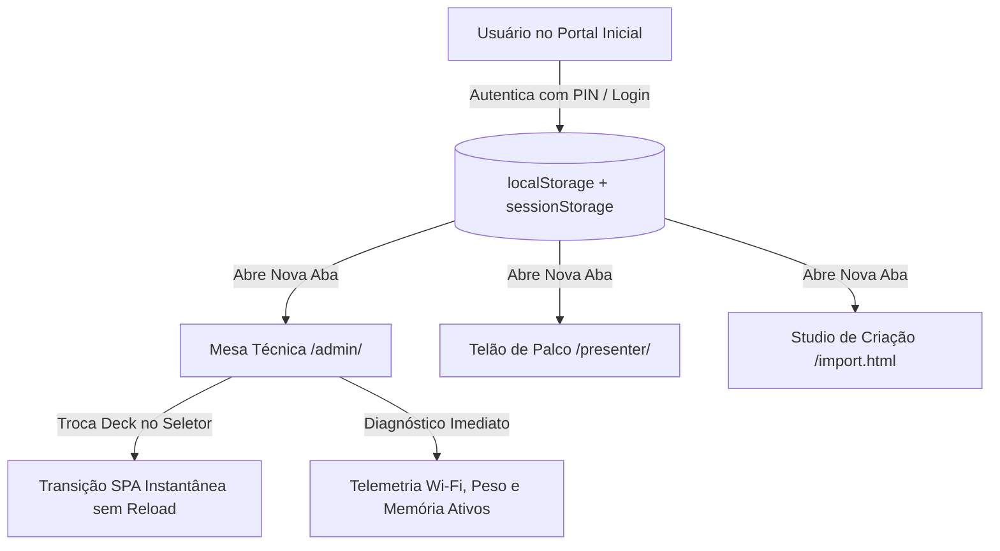

# Plano 20: Single Sign-On (SSO) Cross-Tab, Telemetria Wi-Fi Resiliente e Troca Dinâmica SPA na Mesa Técnica

## 1. Contexto, Diagnóstico & Parecer Técnico

Durante a operação real do ecossistema **SlideMeshLive** em ambiente de evento ao vivo, foram identificados 3 comportamentos críticos de usabilidade, ciclo de vida e arquitetura de sessão:



### 🔍 Auditoria Detalhada dos 3 Pontos Relatados

| # | Situação Observada | Diagnóstico Técnico | Classificação | Resolução Recomendada |
|---|---|---|---|---|
| **01** | **Na seção "Saúde & Capacidade Wi-Fi", campos vazios / `---` (Peso Total do Deck, Memória / Uptime)** | A função `fetchEnvironmentDiagnostics()` só era disparada no final de `startAdminSession()`. Se a tela de bloqueio estivesse ativa, se a troca de deck gerasse reload ou se houvesse delay na API `/api/diagnostics`, os campos permaneciam com o valor HTML estático `---`. | ⚠️ **Problema de Ciclo de Vida e Telemetria** | Executar a telemetria imediatamente no ciclo de inicialização (`init()`), recalcular os dados em memória no carregamento do deck e atualizar via polling periódico. |
| **02** | **Ao selecionar outra apresentação no menu do Painel, é solicitada nova autenticação** | O ouvinte de evento `change` no seletor executava um recarregamento forçado da página (`window.location.href = '?presentation=...'`), reiniciando todo o ciclo do app e perdendo o estado em memória. | ⚠️ **Problema de UX e Arquitetura de Navegação** | Transformar a troca em **transição SPA dinâmica (Single Page Application)** via `loadPresentation()`, atualizando a URL via `window.history.replaceState` sem recarregar a página e sem pedir senha. |
| **03** | **No site inicial autenticado, ao navegar para o Painel/Telão/Studio, a sessão não é aproveitada** | O Portal gravava a autenticação exclusivamente em `sessionStorage`. Pela especificação W3C / HTML5 Web Storage, o `sessionStorage` é **estritamente isolado por aba/janela**. Links abertos em nova aba (`target="_blank"`) iniciam com o storage vazio. | ⚠️ **Problema de Arquitetura de Sessão (Ausência de SSO Cross-Tab)** | Implementar **SSO Local Cross-Tab Unificado** usando `localStorage` como barramento persistente espelhado para `sessionStorage`, com revogação universal ao deslogar. |

---

## 2. Decisões Arquiteturais & Melhores Práticas

### A. Single Sign-On (SSO) Local Cross-Tab
* **Estratégia de Armazenamento:** Utilização da chave corporativa `slidemesh_admin_auth = 'true'` em `localStorage`, acompanhada de `slidemesh_admin_auth_time` e `admin_master_pin_code`.
* **Sincronização Transparente:** Ao inicializar qualquer interface (`index.html`, `/admin/`, `/presenter/`, `import.html`), o `AuthEngine` verifica tanto o `sessionStorage` quanto o `localStorage`. Caso esteja autenticado no `localStorage`, sincroniza automaticamente a chave local para o `sessionStorage` da aba atual.
* **Logout Universal (Anti-Zumbi):** Ao clicar em "Sair / Bloquear / Logout" em qualquer uma das interfaces, o sistema limpa **ambos** os armazenamentos (`sessionStorage` e `localStorage`), garantindo que o fechamento da sessão ocorra em todo o ecossistema.

### B. Navegação SPA (Single Page Application) na Mesa Técnica
* **Zero Page Reload:** A troca de apresentação não reinicia o DOM nem a pilha JavaScript.
* **Ciclo de Troca Reativo:**
  1. `this.presentationId = newPresId`
  2. `window.history.replaceState({}, '', '?presentation=' + newPresId + '&session=' + this.sessionId)`
  3. `await this.engine.loadPresentation(this.presentationId)`
  4. Re-renderização dos thumbnails da régua de slides, título e enquetes.
  5. Atualização imediata do QR Code e do diagnóstico de peso de deck e saúde Wi-Fi.
  6. Transmissão do slide ativo via SSE / Realtime para manter a sincronia.

### C. Telemetria Resiliente & Diagnóstico Imediato
* **Antecipação de Dados:** `fetchEnvironmentDiagnostics()` é chamado logo na inicialização do aplicativo (`init()`), independentemente do estado do modal de bloqueio.
* **Fallback Instantâneo em Memória:** Enquanto a resposta HTTP da API `/api/diagnostics` não chega, os campos "Peso Total do Deck" e "Memória / Uptime" são preenchidos com estimativas calculadas a partir dos slides em memória e tempo de sessão.

---

## 3. Fases de Execução Detalhadas

### Fase 1: Motor de Autenticação Unificado & Barramento SSO Cross-Tab
* **Arquivos:** [`js/core/auth-engine.js`](file:///home/flashbsb/projetos/SlideMeshLive/js/core/auth-engine.js)
* **Ações:**
  1. Padronizar `setAdminAuthenticated(isAuthenticated, masterPin)` para persistir em `sessionStorage` e `localStorage`.
  2. Atualizar `isAdminAuthenticated()` para validar `sessionStorage` e `localStorage` de forma bidirecional.
  3. Ajustar `signInWithLocalCredentials()` para invocar `setAdminAuthenticated(true)` para papéis `admin` e `presenter`.
  4. Garantir que `signOut()` limpe simultaneamente `sessionStorage` e `localStorage`.

### Fase 2: Portal Inicial com Herança Universal de Sessão
* **Arquivos:** [`index.html`](file:///home/flashbsb/projetos/SlideMeshLive/index.html)
* **Ações:**
  1. Ajustar `checkGlobalIntranetLock()` para reconhecer autenticação prévia em `localStorage.getItem('slidemesh_admin_auth') === 'true'`.
  2. Atualizar as funções de desbloqueio (`unlockPortalGlobalPin()`, `unlockPortalGlobalUser()`, `unlockPortalGlobalGoogle()`) para gravar no `localStorage`.
  3. Atualizar `logoutPortal()` para expurgar as chaves de ambos os storages.
  4. Garantir que os botões de ação dos cards (Painel, Telão, Studio, ZIP) herdem a sessão sem solicitar senha redundante.

### Fase 3: Mesa Técnica — Troca Dinâmica SPA e Telemetria Resiliente
* **Arquivos:** [`js/admin/admin-app.js`](file:///home/flashbsb/projetos/SlideMeshLive/js/admin/admin-app.js)
* **Ações:**
  1. Invocar `this.fetchEnvironmentDiagnostics()` logo no início de `init()` e imediatamente após `loadPresentation()`.
  2. Refatorar o listener de `presSelector` para carregar o novo deck em memória de forma assíncrona, atualizando a URL com `history.replaceState` sem disparar `window.location.href`.
  3. Atualizar `updateDiagnosticsUI()` para tratar valores padrão e calcular o peso aproximado dos slides caso o backend esteja em processamento.

### Fase 4: Telão de Palco & SlideMesh Studio
* **Arquivos:** [`js/presenter/presenter-app.js`](file:///home/flashbsb/projetos/SlideMeshLive/js/presenter/presenter-app.js), [`import.html`](file:///home/flashbsb/projetos/SlideMeshLive/import.html)
* **Ações:**
  1. Em `presenter-app.js`, verificar `localStorage.getItem('slidemesh_admin_auth') === 'true'` em `checkPresenterProtection()`.
  2. Ao desbloquear o telão por PIN, gravar também em `localStorage`.
  3. Em `import.html`, verificar `localStorage.getItem('slidemesh_admin_auth') === 'true'` em `checkStudioGlobalProtection()`.
  4. Ao desbloquear o Studio por PIN, sincronizar com o `localStorage`.

### Fase 5: Expansão da Suíte de Testes Automatizada (Teste 39)
* **Arquivos:** [`tests/test_suite.py`](file:///home/flashbsb/projetos/SlideMeshLive/tests/test_suite.py)
* **Ações:**
  1. Implementar o **Teste 39** validando:
     * Métodos de persistência e herança SSO cross-tab em `auth-engine.js`.
     * Reconhecimento de `slidemesh_admin_auth` em `index.html`, `admin-app.js`, `presenter-app.js` e `import.html`.
     * Ausência de `window.location.href` no seletor de apresentações da Mesa Técnica (`admin-app.js`).
     * Chamada antecipada de `fetchEnvironmentDiagnostics()` no ciclo `init()`.
  2. Executar a suíte completa de 39 testes garantindo 100% de aprovação.

---

## 4. Plano de Verificação & Homologação

### Testes Automatizados
```bash
python3 tests/test_suite.py
```
* **Critério de Sucesso:** Aprovação de 39/39 testes automatizados com tempo de execução inferior a 15 segundos.

### Verificação Prática no Navegador
1. **Verificação de Telemetria:**
   * Abrir `/admin/` e constatar que os campos "Peso Total do Deck" e "Memória / Uptime" exibem valores reais imediatamente (ex: `124.5 KB (24.9 KB/slide)` e `32.4 MB • 0h 15m 22s`).
2. **Verificação da Troca SPA de Decks:**
   * No dropdown da Mesa Técnica, alternar entre *Comece por Aqui*, *Showcase* e *Pitch Startup*.
   * Constatar que a troca ocorre em menos de 50ms, os slides da régua mudam instantaneamente e nenhuma tela de senha é exibida.
3. **Verificação de SSO Cross-Tab:**
   * Acessar `/` (Portal Inicial), autenticar com o PIN do evento (`2026`).
   * Abrir a Mesa Técnica (`/admin/`), o Telão (`/presenter/`) e o Studio (`/import.html`) em novas abas separadas.
   * Constatar que todas as 3 abas abrem desbloqueadas e prontas para uso.
   * Clicar em "Sair" em uma das abas e constatar que todas são revogadas com segurança.
