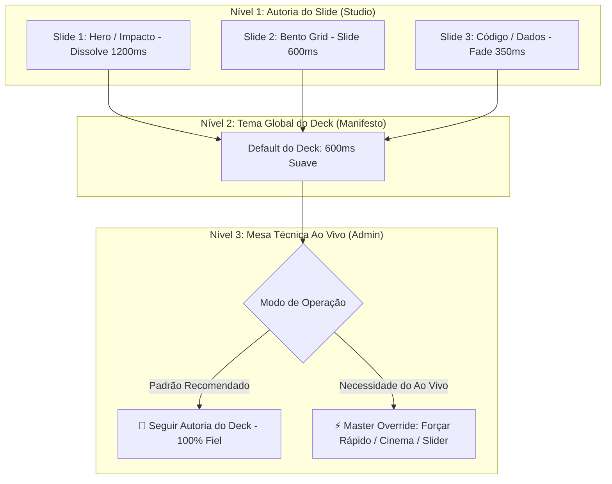

# Plano 21: Arquitetura Híbrida de Transições — Autoria Granular no Studio e Master Override na Mesa Técnica

## 1. Análise Comparativa & Parecer de Engenharia de Software

### ⚖️ O Dilema de Design: Mesa Técnica (Admin) vs. Autoria do Slide (Studio)?

Ao analisar onde o controle de tempo e efeitos de transição deve residir, encontramos três abordagens arquiteturais possíveis:



---

### 📊 Matriz Comparativa das 3 Abordagens

| Abordagem | Vantagens | Desvantagens | Veredito |
|---|---|---|---|
| **Abordagem A: Exclusivo na Mesa Técnica (Admin)** | • Operador ajusta o ritmo ao vivo conforme o tempo da palestra.<br>• Fácil de acelerar se o evento estiver atrasado. | • Engessa a apresentação: todos os slides são forçados ao mesmo tempo.<br>• Um slide de abertura (Hero) perde o efeito solene se o deck estiver em modo rápido. | ❌ **Insuficiente isoladamente** |
| **Abordagem B: Exclusivo na Autoria (Studio / por slide)** | • Liberdade artística total: o designer define tempos diferentes para cada tipo de slide (ex: 1200ms para Citação, 350ms para Código).<br>• Deck 100% autocontido em pacotes ZIP/JSON. | • Se o evento ao vivo exigir aceleração ou desaceleração geral, o operador não consegue intervir sem editar slide por slide. | ❌ **Rígido para o ao vivo** |
| **Abordagem C: Arquitetura Híbrida em Cascata (Padrão Ouro da Indústria)** | • **Melhor dos dois mundos:** O criador define o tempo e efeito de cada slide no Studio.<br>• O Admin roda por padrão no modo **"🎯 Seguir Autoria do Deck"**.<br>• Se necessário no ao vivo, o operador tem a chave mestra de **Master Override** (presets rápidos ou slider contínuo). | • Exige um modelo de herança estruturado no `PresentationEngine` (Slide -> Tema do Deck -> Override do Admin). | 🏆 **RECOMENDADA (Padrão Keynote / ProPresenter / vMix)** |

---

## 2. Decisão Arquitetural: Arquitetura de Herança em 3 Níveis

A decisão recomendada é adotar a **Arquitetura Híbrida em Cascata (Cascade Inheritance)**:

1. **Nível 1 — Granular por Slide (SlideMesh Studio):**
   * No editor de cada slide (`import.html`), além do campo *"Transição do Slide"* (`fade`, `slide`, `zoom`, `dissolve`, `stagger`), adiciona-se o campo *"Velocidade do Slide"*:
     - `🌐 Herdar Global do Deck` (Padrão)
     - `⚡ Rápido (350ms)` — Ideal para slides de dados, terminal/código e comparações.
     - `✨ Suave (600ms)` — Ideal para tópicos, métricas e layouts bento.
     - `🎬 Cinematográfico (950ms)` — Ideal para capas, citações e transições de capítulos.
     - `🌌 Épico / Lento (1400ms)` — Ideal para slides de encerramento e fotos de alto impacto.

2. **Nível 2 — Tema Global do Deck (Manifesto do Deck):**
   * Na barra de configurações gerais do deck no Studio (`import.html`), define-se a velocidade padrão do tema (`theme.transitionDuration: 600`) e o efeito padrão (`theme.transition: "fade"`), servindo de fallback para qualquer slide que utilize "Herdar Global".

3. **Nível 3 — Mesa Técnica com Master Override (Mesa de Controle /admin/):**
   * No card **"🎬 Transições & Ritmo do Palco"**, o operador tem:
     * **Modo Mestre:**
       - **`🎯 Seguir Autoria do Deck (Padrão)`**: O palco executa dinamicamente o tempo e o efeito exato planejado para cada slide pelo autor.
       - **`⚡ Forçar Modo Rápido (350ms)`**: Sobrescreve todos os slides para ritmo acelerado.
       - **`✨ Forçar Modo Suave (600ms)`**: Sobrescreve para ritmo equilibrado.
       - **`🎬 Forçar Modo Cinematográfico (950ms)`**: Sobrescreve para transições solenes.
       - **`🌌 Forçar Modo Épico (1400ms)`**: Sobrescreve para transições lentas.
       - **`🎛️ Slider Contínuo (200ms a 2000ms)`**: Ajuste fino do operador com feedback em tempo real.
     * **Botão "👁️ Testar Transição"**: Permite validar o efeito no telão antes de avançar.

---

## 3. Plano de Execução Faseado

### Fase 1: Motor de Transições em Cascata & CSS Dinâmico
* **Arquivos:** [`css/presenter.css`](file:///home/flashbsb/projetos/SlideMeshLive/css/presenter.css), [`js/core/presentation-engine.js`](file:///home/flashbsb/projetos/SlideMeshLive/js/core/presentation-engine.js)
* **Ações:**
  1. Elevar a duração base nativa no CSS de `380ms` para `600ms` (`var(--stage-trans-duration, 600ms)`).
  2. Implementar a cadeia de resolução de tempo e efeito no `PresentationEngine.resolveSlideTransition(slide, adminOverride)`:
     ```javascript
     // Ordem de precedência:
     // 1. Admin Override (se ativo)
     // 2. Configuração individual do Slide (slide.presenter.transitionDuration)
     // 3. Configuração do Tema do Deck (manifest.theme.transitionDuration)
     // 4. Default do Sistema (600ms)
     ```
  3. Ajustar `renderSlideHtml` para calcular a classe CSS e a duração em milissegundos correspondente.

### Fase 2: Autoria Granular no SlideMesh Studio (`import.html`)
* **Arquivos:** [`import.html`](file:///home/flashbsb/projetos/SlideMeshLive/import.html), [`js/core/conversion-engine.js`](file:///home/flashbsb/projetos/SlideMeshLive/js/core/conversion-engine.js)
* **Ações:**
  1. Adicionar o seletor **"Velocidade do Slide"** (`#edit-slide-speed`) na linha de propriedades visuais de cada slide no Studio.
  2. Adicionar o seletor **"Velocidade Padrão do Deck"** (`#cfg-transition-speed`) na barra de configuração do deck (Etapa 2).
  3. Vincular a leitura e gravação bidirecional dos campos no `currentConvertedData` e na exportação ZIP/JSON.

### Fase 3: Painel da Mesa Técnica com Modo "Seguir Deck" & Master Override
* **Arquivos:** [`admin/index.html`](file:///home/flashbsb/projetos/SlideMeshLive/admin/index.html), [`js/admin/admin-app.js`](file:///home/flashbsb/projetos/SlideMeshLive/js/admin/admin-app.js)
* **Ações:**
  1. Adicionar o card **"🎬 Transições & Ritmo do Palco"** na Coluna 1 da Mesa Técnica.
  2. Implementar os controles de:
     * Modo de Transição (Dropdown com *Seguir Deck*, *Forçar Rápido*, *Forçar Suave*, *Forçar Cinema*, *Forçar Épico*, *Slider Manual*).
     * Slider de Ajuste Fino (`200ms` a `2000ms`) com badge indicador.
     * Seletor de Efeito Override Global (*Seguir Deck*, *Fade*, *Slide 3D*, *Zoom*, *Dissolve*, *Cascata*).
     * Botão *"👁️ Testar Transição"*.
  3. Integrar ao ciclo de inicialização e salvamento em sessão.

### Fase 4: Protocolo de Sincronização em Tempo Real & Palco
* **Arquivos:** [`js/core/realtime-engine.js`](file:///home/flashbsb/projetos/SlideMeshLive/js/core/realtime-engine.js), [`js/presenter/presenter-app.js`](file:///home/flashbsb/projetos/SlideMeshLive/js/presenter/presenter-app.js), [`js/core/i18n-engine.js`](file:///home/flashbsb/projetos/SlideMeshLive/js/core/i18n-engine.js)
* **Ações:**
  1. Adicionar tratamento do evento `STAGE_CONFIG_UPDATE` e `STAGE_TRANSITION_TEST` no `RealtimeEngine`.
  2. Em `presenter-app.js`, injetar as CSS Custom Properties no `:root` no momento de troca de cada slide de acordo com a resolução em cascata.
  3. Adicionar as chaves de tradução bilíngues (PT-BR e EN) em `i18n-engine.js`.

### Fase 5: Expansão da Suíte de Testes Automatizada (Teste 40)
* **Arquivos:** [`tests/test_suite.py`](file:///home/flashbsb/projetos/SlideMeshLive/tests/test_suite.py)
* **Ações:**
  1. Criar o **Teste 40** validando:
     * Resolução de herança em cascata no `PresentationEngine`.
     * Controles no SlideMesh Studio (`import.html` e `conversion-engine.js`).
     * Controles e modos de Master Override na Mesa Técnica (`admin/index.html` e `admin-app.js`).
     * Sincronização e aplicação de variáveis CSS no Telão (`presenter-app.js`).
     * Dicionário i18n em PT-BR e EN.
  2. Executar a suíte completa de 40 testes garantindo 100% de aprovação.

---

## 4. Matriz de Decisão para o Usuário

```text
Opção 1: Arquitetura Híbrida em Cascata (Recomendada)
  ├── No Studio: Criador tem controle por slide (aberturas lentas, dados rápidos)
  └── Na Mesa Técnica: Admin roda em "Seguir Deck" com opção de "Master Override" ao vivo

Opção 2: Exclusivo no Studio
  └── Apenas quem cria a apresentação define as velocidades; Mesa Técnica não intervém

Opção 3: Exclusivo na Mesa Técnica
  └── O operador define uma velocidade global única para todos os slides do evento
```
