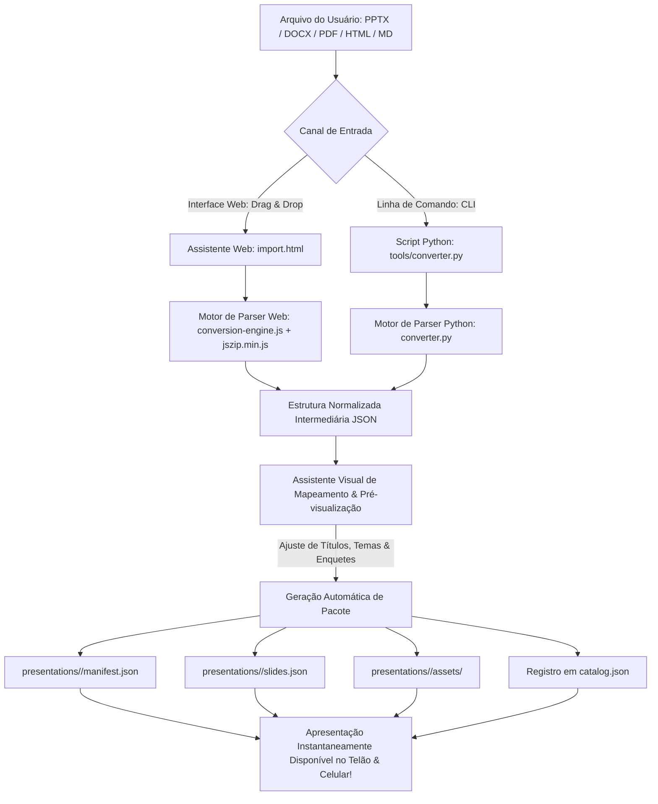

# 📋 Plano de Implantação: Motor de Conversão e Importação Dinâmica de Conteúdos (PowerPoint, Word DOCX, HTML/Markdown e PDF)

> **Documento de Engenharia & Arquitetura de Produto**  
> **Status:** 🎯 Proposta Técnica Estruturada (Aguardando Aprovação)  
> **Data:** 31 de Agosto de 2026  
> **Objetivo:** Viabilizar a importação e conversão fluida de conteúdos existentes nos formatos **PowerPoint (`.pptx`)**, **Microsoft Word (`.docx`)**, **HTML / Markdown (`.html`, `.md`)** e **PDF (`.pdf`)** para o formato nativo do **SlideMeshLive** (`manifest.json`, `slides.json` e `assets/`), garantindo máxima fidelidade semântica, enriquecimento interativo (enquetes, notas do orador e split-screen) e uma experiência de usuário (UX) intuitiva e com zero perda de conteúdo.

---

## 📑 Sumário Executivo

1. [Diagnóstico & Justificativa do Recurso](#1-diagnóstico--justificativa-do-recurso)
2. [Análise de Viabilidade Técnica por Formato (PPTX, DOCX, HTML/MD, PDF)](#2-análise-de-viabilidade-técnica-por-formato)
3. [Matriz de Riscos, Perdas Comuns e Estratégias de Mitigação](#3-matriz-de-riscos-perdas-comuns-e-estratégias-de-mitigação)
4. [Mapeamento Específico para Documentos do Microsoft Word (`.docx`)](#4-mapeamento-específico-para-documentos-do-microsoft-word-docx)
5. [Arquitetura Geral da Solução (Motor Híbrido Web + CLI)](#5-arquitetura-geral-da-solução-motor-híbrido-web--cli)
6. [Especificação dos Componentes e Módulos](#6-especificação-dos-componentes-e-módulos)
7. [Fluxo de Experiência do Usuário (UX Passo a Passo)](#7-fluxo-de-experiência-do-usuário-ux-passo-a-passo)
8. [Plano de Fases e Cronograma de Implementação](#8-plano-de-fases-e-cronograma-de-implementação)
9. [Critérios de Aceite e Testes Automatizados](#9-critérios-de-aceite-e-testes-automatizados)
10. [Prompts Guiados por Fase](#10-prompts-guiados-por-fase)

---

## 1. Diagnóstico & Justificativa do Recurso

Atualmente, para criar uma nova apresentação no SlideMeshLive, o usuário precisa:
1. Criar manualmente um diretório em `presentations/<id>/`.
2. Escrever a estrutura JSON de `manifest.json` e `slides.json`.
3. Adicionar ativos em `assets/` e registrar a entrada em `presentations/catalog.json`.

Grande parte dos palestrantes, autores, engenheiros e professores possui seus materiais em formatos consolidados:
- **Apresentações:** PowerPoint (`.pptx`).
- **Apostilas, Planos de Aula, Relatórios Técnicos e Artigos:** Microsoft Word (`.docx`).
- **Documentações Técnicas:** Markdown / HTML (`.md`, `.html`).
- **Manuais e Slides Exportados:** Adobe PDF (`.pdf`).

### O Desafio Central:
Transformar um documento de texto longo (como um arquivo do Word) ou uma apresentação convencional (PowerPoint) para o SlideMeshLive **não pode ser uma mera colagem de texto**, pois isso desvirtuaria a proposta da plataforma. O motor deve aplicar uma **Conversão Semântica Inteligente**:
- **Telão do Apresentador (Clean Stage):** Recebe o título de destaque, tópicos sintetizados e imagens/diagramas em Split-Screen.
- **Smartphone da Audiência (Deep Dive):** Recebe parágrafos explicativos completos, tabelas e listas aprofundadas.
- **Modo Púlpito (`Tecla [P]`):** Recebe anotações de rodapé, notas de orador e comentários do autor.

---

## 2. Análise de Viabilidade Técnica por Formato

| Formato de Origem | Estrutura Interna | Viabilidade | Nível de Fidelidade Semântica | Componentes Extraídos |
|:---|:---|:---:|:---:|:---|
| **PowerPoint (`.pptx`)** | Pacote ZIP contendo XMLs estruturados (`ppt/slides/slideX.xml`, `ppt/notesSlides/`, `ppt/media/`) | 🟢 **ALTA** | ⭐⭐⭐⭐⭐ (95%+) | • Título e Bullets<br>• Notas do Orador (`notesSlides`)<br>• Imagens/Gráficos embutidos (`media/`)<br>• Ordem de slides |
| **Microsoft Word (`.docx`)** | Pacote ZIP contendo XML estruturado (`word/document.xml`, `word/media/`, `word/styles.xml`) | 🟢 **ALTA** | ⭐⭐⭐⭐⭐ (95%+) | • Títulos (Heading 1/2 como delimitadores de slide)<br>• Listas e tópicos com marcadores<br>• Tabelas completas para o celular<br>• Imagens embutidas para o Telão |
| **HTML / Markdown (`.html`, `.md`)** | Texto estruturado com tags semânticas (`<h1>`, `<h2>`, `<ul>`, `<table>`, `<code>`) ou separadores (`---`) | 🟢 **ALTA** | ⭐⭐⭐⭐⭐ (99%+) | • Título e Bullets<br>• Tabelas completas<br>• Blocos de Código<br>• Comentários como Notas (`<!-- note: ... -->`) |
| **PDF (`.pdf`)** | Documento vetorial/paginado estático com fluxos de texto (PDF streams) e objetos gráficos | 🟡 **MÉDIA** | ⭐⭐⭐⭐ (85%+) | • Imagem HD de cada página (Canvas/SVG)<br>• Texto extraído por página para o Celular<br>• Título detectado por heurística de fonte |

---

## 3. Matriz de Riscos, Perdas Comuns e Estratégias de Mitigação

```
┌─────────────────────────────────────────────────────────────────────────────────────────────┐
│ 🛑 PROBLEMA POTENCIAL            │ 💡 IMPACTO NA CONVERSÃO       │ 🛡️ SOLUÇÃO SLIDEMESHLIVE  │
├──────────────────────────────────┼───────────────────────────────┼───────────────────────────┤
│ Documento Word contínuo sem      │ Como saber onde começa e      │ Heurística de Heading 1/2 │
│ quebra de slides explícita       │ termina cada slide?           │ + Quebras de página Word  │
├──────────────────────────────────┼───────────────────────────────┼───────────────────────────┤
│ Textos muito longos do Word ou   │ Telão poluído e ilegível      │ Regra 3-Bullets no Telão  │
│ de slides PPTX antigos           │ igual a slides antigos        │ + Texto integral no Phone │
├──────────────────────────────────┼───────────────────────────────┼───────────────────────────┤
│ Tabelas complexas em documentos  │ Não cabem bem em slides       │ Mapeamento automático na  │
│ do Word ou HTML                  │ widescreen sem quebrar layout │ aba audience.sections     │
├──────────────────────────────────┼───────────────────────────────┼───────────────────────────┤
│ Imagens e diagramas embutidos    │ Perda de gráficos e esquemas  │ Extração direta do ZIP    │
│ em arquivos DOCX / PPTX          │ técnicos                      │ (word/media & ppt/media)  │
├──────────────────────────────────┼───────────────────────────────┼───────────────────────────┤
│ Dependências pesadas de sistema  │ Dificuldade de instalação em  │ Motor 100% Web-Nativo     │
│ (LibreOffice, Poppler, C-libs)   │ ambientes offline ou Windows  │ (JS/WebAssembly + Python) │
└──────────────────────────────────┴───────────────────────────────┴───────────────────────────┘
```

---

## 4. Mapeamento Específico para Documentos do Microsoft Word (`.docx`)

Arquivos do Microsoft Word seguem o padrão OpenXML (arquivo ZIP). O `conversion-engine.js` processará o arquivo com a seguinte estratégia:

### A. Delimitação Inteligente de Slides (Slide Boundaries):
1. **Prioridade 1 — Título 1 / Heading 1 (`<w:pStyle w:val="Heading1"/>`):**  
   Cada seção principal gera um novo slide.
2. **Prioridade 2 — Quebras de Página Explícitas (`<w:br w:type="page"/>`):**  
   Força a divisão para o próximo slide.
3. **Prioridade 3 — Título 2 / Heading 2 (quando o documento não possui Heading 1):**  
   Subdivisões se tornam slides consecutivos.

### B. Distribuição de Conteúdo Telão vs Celular:
- **Título do Slide:** Nome da seção (`Heading 1`).
- **Bullets do Telão (`presenter.bullets`):** Parágrafos com marcadores (`<w:numPr>`) e os 3 primeiros pontos-chave da seção.
- **Detalhamento no Smartphone (`audience.sections`):** Todo o corpo de texto explicativo daquela seção, preservando parágrafos, ênfases (negrito/itálico) e links.
- **Tabelas (`<w:tbl>`):** Extraídas com colunas e linhas preservadas para a visualização no smartphone.
- **Imagens (`word/media/*`):** Extraídas e associadas ao slide para exibição em Split-Screen no telão.

---

## 5. Arquitetura Geral da Solução (Motor Híbrido Web + CLI)



---

## 6. Especificação dos Componentes e Módulos

### 6.1 Motor de Extração Web (`js/core/conversion-engine.js`)
- **Parser PPTX:** Extrai slides, bullets, notas de orador (`ppt/notesSlides/`) e imagens (`ppt/media/`).
- **Parser DOCX:** Extrai seções baseadas em headings, parágrafos, listas numeradas/marcadores, tabelas e imagens (`word/media/`).
- **Parser Markdown/HTML:** Extrai seções (`---`, `<h1>`, `<h2>`), código syntax, tabelas e comentários como notas.
- **Parser PDF (`pdfjs-dist`):** Renderiza páginas em Canvas HD para o Telão e extrai fluxos de texto para os celulares.

### 6.2 Assistente Visual de Importação (`import.html` & Modal Integrado)
- Área de *Drag & Drop* moderna com suporte a `.pptx`, `.docx`, `.pdf`, `.html`, `.md`.
- **Painel de Pré-Visualização Lado a Lado (Side-by-Side Review):**
  - Mostra em tempo real como o conteúdo ficará no Telão do Apresentador e na tela do Celular do participante.
  - Permite ao usuário com 1 clique:
    - Alterar a ordem dos slides ou mesclar seções.
    - Transformar um slide de pergunta em **Enquete Interativa** (adicionando opções A, B, C, D).
    - Selecionar o tema padrão da apresentação (Dark, Light, Slate ou High Contrast).
    - Definir a chave de segurança (Pública, Protegida por PIN ou Restrita à Mesa Técnica).

### 6.3 Endpoint Backend de Importação Segura (`server.py` `/api/presentations/import`)
- Endpoint HTTP `POST /api/presentations/import` com:
  - Validação rigorosa de payload JSON (schema do `manifest.json` e `slides.json`).
  - Sanitização de slug e prevenção de Path Traversal (`os.path.abspath` verificado dentro de `presentations/`).
  - Gravação atômica dos arquivos e das imagens em base64/binário para a pasta `presentations/<slug>/assets/`.
  - Atualização instantânea e atômica de `presentations/catalog.json`.

---

## 7. Fluxo de Experiência do Usuário (UX Passo a Passo)

```text
[ PASSO 1: Seleção do Arquivo ]
   O usuário clica em "📤 Importar PPTX / DOCX / PDF / MD" no portal inicial (index.html)
   ou arrasta o arquivo diretamente para a tela.
                │
                ▼
[ PASSO 2: Processamento e Extração Instantânea (< 2 segundos) ]
   O motor descompacta e analisa o arquivo localmente no navegador,
   extraindo slides/seções, tópicos, notas do palestrante e imagens sem depender de servidores externos.
                │
                ▼
[ PASSO 3: Pré-Visualização Inteligente & Customização Rápida ]
   O usuário visualiza a lista de slides gerados:
   • Slide 1: [ Telão: Split-Screen ] [ Celular: Texto Completo ] [ Notas: ✓ ]
   • Slide 2: [ Converter em Enquete? (Sim / Não) ]
   • Configura: Título, Código de Sessão e Tema Visual.
                │
                ▼
[ PASSO 4: Publicação em 1 Clique ]
   O usuário clica em "🚀 Publicar Apresentação".
   A pasta é criada, o catálogo é atualizado e o sistema abre automaticamente
   os links prontos do Telão (presenter/) e do QR Code do Celular (audience/).
```

---

## 8. Plano de Fases e Cronograma de Implementação

### Fase 1: Motor de Parser e Extração Semântica (PPTX, DOCX, MD/HTML)
- Criação de `js/core/conversion-engine.js` com suporte completo a PPTX, DOCX (Word) e Markdown/HTML.
- Inclusão da biblioteca leve `lib/jszip.min.js` (zero dependências externas).
- Extração de títulos, tópicos, imagens, tabelas e notas do orador.

### Fase 2: Backend de Importação e Criação de Apresentações
- Implementação do endpoint `POST /api/presentations/import` no `server.py`.
- Suporte a upload de assets embutidos e escrita atômica de `manifest.json` e `slides.json`.
- Atualização em tempo real de `presentations/catalog.json`.

### Fase 3: Interface Visual do Assistente de Importação
- Criação de `import.html` com o fluxo completo de Drag & Drop, Pré-visualizador e Editor Rápido.
- Integração do botão *"📤 Importar Apresentação"* no cabeçalho e nos cards do portal [`index.html`](file:///home/flashbsb/projetos/SlideMeshLive/index.html).
- Internacionalização completa em `pt-BR` e `en-US` (`i18n-engine.js`).

### Fase 4: Suporte a PDF e Fallback Visual de Alta Resolução
- Integração do parser de PDF com renderização de páginas em Canvas e extração de texto para `audience.summary`.
- Mapeamento inteligente de páginas como imagens no Telão com Split-Screen.

### Fase 5: CLI Python e Suíte de Testes Automatizados
- Criação de `tools/import_presentation.py` para importação direta via terminal (PPTX, DOCX, PDF, MD).
- Atualização de `scratch/test_suite.py` adicionando testes unitários e de integração de ponta a ponta para conversão de arquivos de exemplo.

---

## 9. Critérios de Aceite e Testes Automatizados

1. **Integridade Estrutural:** Qualquer apresentação gerada pelo conversor (seja de PPTX, DOCX, PDF ou MD) deve ser 100% compatível com o schema do catálogo e passar sem erros em `test_catalog_and_presentations_integrity()`.
2. **Preservação de Conteúdo:** Nenhuma imagem, tabela ou nota do orador existente no arquivo original pode ser perdida no processo de conversão.
3. **Desempenho:** Documentos de até 50 páginas/slides devem ser processados e pré-visualizados no navegador em menos de 2,5 segundos.
4. **Segurança:** O endpoint de importação deve rejeitar tentativas de path traversal (ex: `../../etc`), uploads corrompidos ou nomes de slug inválidos.

---

## 10. Prompts Guiados por Fase

- **Prompt Fase 1:**  
  `"Implemente o motor de extração semântica js/core/conversion-engine.js com suporte a PowerPoint PPTX, Microsoft Word DOCX (via jszip) e Markdown/HTML, validando a extração de títulos, bullets, notas, tabelas e imagens."`

- **Prompt Fase 2:**  
  `"Implemente o endpoint seguro POST /api/presentations/import no server.py com escrita atômica dos manifests, slides e assets, e atualização do catalog.json."`

- **Prompt Fase 3:**  
  `"Crie a interface import.html e conecte o assistente de importação no portal index.html, com suporte a Drag & Drop de PPTX, DOCX, MD e PDF, pré-visualização lado a lado e seleção de temas."`

- **Prompt Fase 4:**  
  `"Integre o suporte à conversão de arquivos PDF com renderização em Canvas de alta fidelidade e extração de texto para os celulares da plateia."`

- **Prompt Fase 5:**  
  `"Crie a ferramenta CLI tools/import_presentation.py com suporte a DOCX, PPTX, MD e PDF, e adicione testes automatizados na suíte scratch/test_suite.py."`
