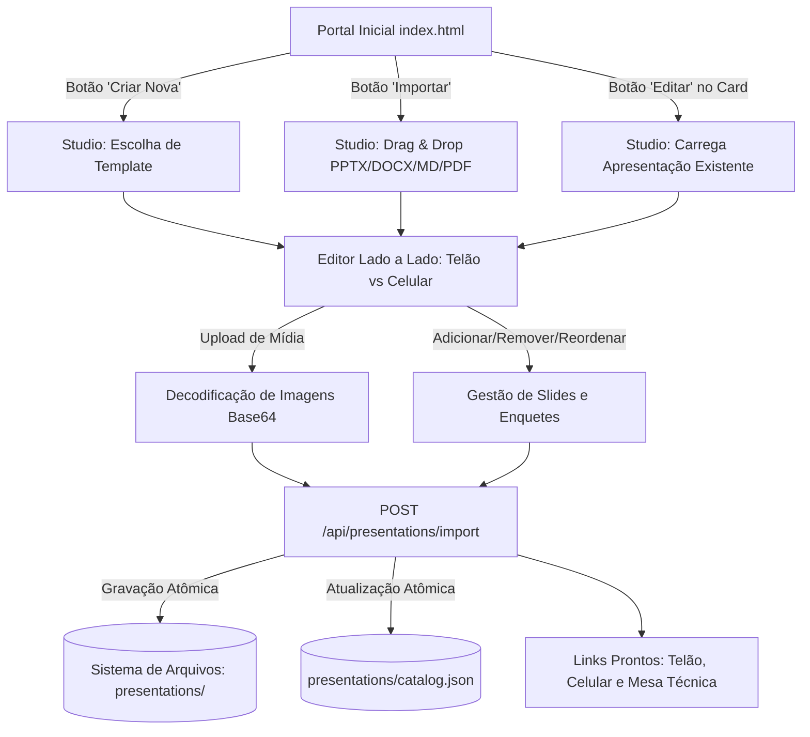

# Plano de Implantação: SlideMesh Studio — Criação e Edição Nativa Web de Apresentações

**Data:** 31 de Agosto de 2026  
**Status:** Planejado / Pronto para Aprovação  
**Módulos Impactados:** `import.html` (Studio), `index.html`, `js/core/conversion-engine.js`, `server.py`, `js/core/i18n-engine.js`, `scratch/test_suite.py`

---

## 1. Visão Geral e Justificativa Arquitetural

O **SlideMeshLive** consolidou motores de sincronização em tempo real (LAN/Web), modo split-screen para palestrantes, suporte a múltiplos temas e um motor de extração semântica para migração de arquivos PowerPoint (`.pptx`), Word (`.docx`), Markdown (`.md`), HTML (`.html`) e PDF (`.pdf`).

Para expandir a autonomia do usuário e consolidar a plataforma como uma **suíte completa de autoria interativa (SlideMesh Studio)**, este plano detalha a unificação do motor para permitir:
1. **Criação de Apresentações do Zero via Web** com escolha de templates inteligentes (Executivo, Técnico, Treinamento com Quiz e Em Branco).
2. **Edição de Apresentações Existentes no Catálogo** (`import.html?edit=<id>`), permitindo alterar títulos, bullets, notas de orador, enquetes e adicionar novos slides diretamente no navegador.
3. **Upload de Imagens e Diagramas por Slide**, viabilizando o enriquecimento visual e o modo Split-Screen no telão.
4. **Auto-Save de Rascunhos** via `localStorage` para prevenir perda acidental de trabalho antes da publicação.

---

## 2. Decisão de Design: Motor Unificado vs. Motor Separado

Adota-se a **Abordagem de Motor Unificado**:
- **Consistência:** A mesma interface (`import.html` / `studio`) atende tanto à importação de documentos externos quanto à criação do zero e à edição de apresentações existentes.
- **Padronização:** Um único gerador de JSON assegura que `manifest.json` e `slides.json` estejam sempre em estrita conformidade com os requisitos de segurança e renderização.
- **Zero Duplicação:** Atualizações em componentes de visualização ou enquetes se propagam imediatamente para todos os fluxos.

---

## 3. Detalhamento dos Novos Recursos

### 3.1. Galeria de Templates Pré-Fabricados (Evitando a "Folha em Branco")
Ao iniciar uma criação do zero, o usuário poderá escolher entre 4 templates prontos:
1. **Template Executivo / Pitch:**
   - Slide 1: Capa & Contexto do Negócio
   - Slide 2: Desafio / Problema Atual
   - Slide 3: Proposta de Solução & Diferenciais
   - Slide 4: Enquete Interativa de Validação com a Audiência
   - Slide 5: Próximos Passos & Chamada para Ação
2. **Template Treinamento / Aula Técnica:**
   - Slide 1: Objetivos de Aprendizagem
   - Slide 2: Conceito Teórico & Arquitetura
   - Slide 3: Estudo de Caso Prático / Diagrama
   - Slide 4: Quiz ao Vivo / Teste de Fixação Interativo
   - Slide 5: Resumo e Materiais de Apoio
3. **Template Demonstração de Produto:**
   - Slide 1: Apresentação da Solução
   - Slide 2: Recursos Principais & Benefícios
   - Slide 3: Votação de Prioridades com a Plateia
   - Slide 4: Perguntas e Respostas (Q&A)
4. **Template em Branco:**
   - 1 Slide básico com campos vazios para liberdade total de escrita.

### 3.2. Edição de Apresentações Já Registradas (`?edit=<id>`)
- No portal inicial [`index.html`](file:///home/flashbsb/projetos/SlideMeshLive/index.html), cada card de apresentação receberá o botão **`✏️ Editar`**.
- O editor lê `presentations/<id>/manifest.json` e `presentations/<id>/slides.json` e preenche todos os formulários e a lista de slides.
- Ao clicar em **`Salvar Alterações`**, o backend atualiza os arquivos existentes de forma atômica e idempotente.

### 3.3. Upload e Gestão de Imagens no Slide (Split-Screen)
- No formulário do Telão, haverá a seção **"Mídia do Slide (Telão Split-Screen)"**.
- O usuário pode selecionar uma imagem (`.png`, `.jpg`, `.jpeg`, `.svg`, `.webp`) ou colar da área de transferência.
- O navegador converte a imagem para Base64 e o preview renderiza instantaneamente o layout split-screen de duas colunas no telão e a ilustração no smartphone.

### 3.4. Auto-Save de Rascunho Local
- Toda alteração nos formulários salva uma cópia em `localStorage.getItem('slidemesh_studio_draft')`.
- Caso o usuário feche acidentalmente o navegador, uma notificação discreta oferecerá: *"Restaurar rascunho em andamento?"*.

---

## 4. Fases de Execução e Entregáveis

| Fase | Descrição | Arquivos Impactados |
| :--- | :--- | :--- |
| **Fase 1** | **Galeria de Templates & Modo Criação:** Criação dos templates pré-fabricados em `conversion-engine.js` e interface de seleção de templates em `import.html`. | `js/core/conversion-engine.js`, `import.html`, `js/core/i18n-engine.js` |
| **Fase 2** | **Upload de Mídia por Slide (Split-Screen):** Campo de upload de imagem, preview com split-screen dinâmico e integração com o empacotador de assets Base64. | `import.html`, `js/core/presentation-engine.js` |
| **Fase 3** | **Fluxo de Edição de Apresentações Existentes:** Leitura de apresentações via URL (`?edit=slug`), botão `✏️ Editar` em `index.html` e salvamento idempotente no `server.py`. | `index.html`, `import.html`, `server.py` |
| **Fase 4** | **Auto-Save & Recuperação de Rascunhos:** Persistência no `localStorage` com alerta e restauração em 1 clique. | `import.html`, `js/core/i18n-engine.js` |
| **Fase 5** | **Testes Automatizados & Documentação:** Adição de testes de criação do zero e edição existente em `scratch/test_suite.py` e atualização do `README.md` e `docs.html`. | `scratch/test_suite.py`, `README.md`, `docs.html` |

---

## 5. Plano de Verificação e Segurança

1. **Segurança no Upload de Mídia:**
   - Limite de tamanho de imagem: 10MB por arquivo.
   - Validação de tipos MIME permitidos: `image/png`, `image/jpeg`, `image/svg+xml`, `image/webp`.
   - Sanitização de nomes de arquivos de imagem (`re.sub(r'[^a-zA-Z0-9._-]', '', filename)`).
2. **Suíte de Testes Automatizados:**
   - Teste de criação a partir de template via API.
   - Teste de edição/sobrescrita de apresentação existente.
   - Teste de upload e gravação de assets de mídia.
   - Validação da simetria i18n em `pt-BR` e `en-US`.
